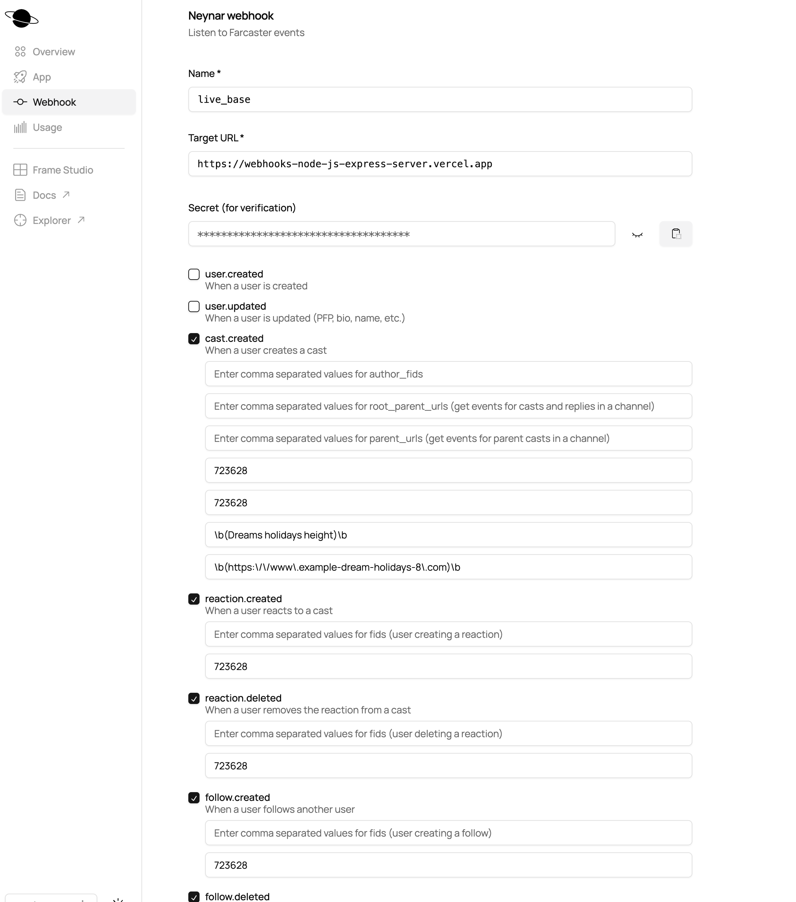

When the Webhooks server receives a a request by the Neynar protocol it firstly runs "verifyWebhookSignature"

This checks the received signature against any of the three signatures of webhooks we run in Neynar.

One signature is for using ngrok for local development, one signature is for the dedicated Sepolia webhook and the last signature is for the dedicated Base webhook.

If the received signature does not match any of the three signatures above then no further analysis is performed.

If it does match the Sepolia or Ngrok signature then it establishes a connection to the Spark smart conctracts using a Sepolia wallet, otherwise it establishes a connection to the smart contracts using a Base Wallet.

Next to be called is analyseWebhookData which analyses the received data to the intrested categories e.g. like, reaction, cast_created etc.

This is followed by analyzing in detail the specific Farcaster action performed.
By reading the relevant data from the Sparks protocol smart contracts it is established whether the received data is eligible.

If this data received is eligible then an array of structs (representing an array of Farcaster actions) of the form:

```
   struct Squawk {
        uint[] data;
        uint created_at;
        uint code;
        uint user_fid;
        uint user_followers;
        address cast_hash;
        address replyTo_cast_hash;
        string embeded_string;
        uint nonce;
        uint processed; // 0 for not processed, 1 for processed
    }
```

is prepared and pushed to SquawkProcessor smart contract using

```
    function addSquawkData(Squawk[] memory newSquawks) external OnlyAdmins

```

From that point on the process continues via other Spark protocol's procedures
e.g. Keepers server calls:

```
    function processSquawkData(uint _range) external OnlyAdmins returns (bool)
```

to process the smart contract stored data.

---

### Neynar Webhooks

Targets


Subscriptions as submitted during New Campaign Creation at the Spark Website



---
